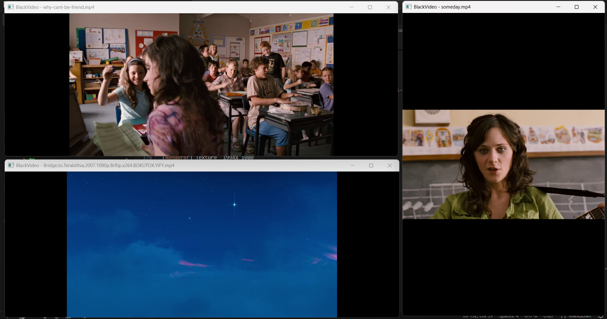

# BlackVideo Mini Player

Lightweight cross-platform video player (Ada + SDL2 + FFmpeg). Support player for the [BlackVideo](https://github.com/BlackBlazent/BlackVideo). Works standalone via **CLI** or **right-click** on any video file.

<p align="center"> <!-- Core Badges --> <p align="center">    </p> <!-- Tech Stack --> <p align="center">       </p> <!-- Ecosystem --> <p align="center">  </p> </p>

---

## File Structure

```
blackvideo-mini-player/
│
├── src/
│   ├── main.adb                  ← Entry point
│   ├── player.ads / .adb         ← Core orchestrator + event loop
│   ├── video_decoder.ads / .adb  ← FFmpeg decode pipeline
│   ├── renderer.ads / .adb       ← SDL2 texture rendering (letterbox)
│   ├── audio.ads / .adb          ← SDL2 audio callback + volume/mute
│   └── utils.ads / .adb          ← Base_Name, Format_Time
│
├── bindings/
│   ├── ffmpeg/
│   │   ├── ffmpeg-avutil.ads       ← libavutil (AVFrame, pixel formats)
│   │   ├── ffmpeg-avcodec.ads      ← libavcodec (decode, context, packet)
│   │   ├── ffmpeg-avformat.ads     ← libavformat (container open/read/seek)
│   │   ├── ffmpeg-swscale.ads      ← libswscale (YUV→RGB)
│   │   └── ffmpeg-swresample.ads   ← libswresample (audio resample)
│   └── sdl2/
│       ├── sdl.ads                 ← SDL_Init / Quit / Delay
│       ├── sdl-video.ads           ← SDL.Video shared types (handles, SDL_Rect)
│       ├── sdl-video-windows.ads/adb    ← SDL.Video.Windows (child package)
│       ├── sdl-video-renderers.ads/adb  ← SDL.Video.Renderers
│       ├── sdl-video-textures.ads/adb   ← SDL.Video.Textures
│       ├── sdl-events.ads/adb      ← SDL.Events (flat byte extractor)
│       ├── sdl-events-keyboards.ads← SDL.Events.Keyboards (keycodes)
│       └── sdl-audio.ads           ← SDL.Audio (callback, device)
│
├── tools/
│   └── context_menu/
│       ├── install_context_menu.bat    ← Windows: installs right-click (run as admin)
│       ├── install_context_menu.reg    ← Windows: manual .reg import
│       ├── uninstall_context_menu.bat  ← Windows: remove right-click
│       ├── uninstall_context_menu.reg
│       ├── install_linux.sh            ← Linux: installs binary + .desktop
│       ├── blackvideo-player.desktop   ← Linux: MIME association file
│       └── install_macos.sh            ← macOS: creates Quick Action service
│
├── lib/              ← Put Windows DLLs / import libs here
|   └──include/       ← Put FFmpeg headers here
├── build/            ← Compiled output goes here
├── scripts/
│   ├── build.bat     ← Windows build (auto-finds gprbuild)
│   └── build.sh      ← Linux/macOS build
└── blackvideo_player.gpr   ← GNAT project file
```

---

## Keyboard Controls

| Key | Action |
|-----|--------|
| `SPACE` | Play / Pause |
| `←` | Seek −5 seconds |
| `→` | Seek +5 seconds |
| `↑` | Volume +10 |
| `↓` | Volume −10 |
| `M` | Mute / Unmute |
| `F` | Fullscreen toggle |
| `ESC` / `Q` | Quit |

---

## Building

### Windows

#### Prerequisites
1. Install [Alire](https://alire.ada.dev/) (GNAT + gprbuild)
   ```
   alr toolchain --select
   ```
2. Download [SDL2 development libraries](https://github.com/libsdl-org/SDL/releases) (MinGW version)
3. Download [FFmpeg shared builds](https://github.com/BtbN/FFmpeg-Builds/releases) (win64-lgpl)
4. From the SDL2 zip, copy `lib/x64/libSDL2.dll.a` → your project's `lib/libSDL2.a`
5. From the FFmpeg zip, copy `lib/*.lib` (or `lib/*.a`) → your project's `lib/`
6. Copy all `.dll` files to `build/` (beside the final `.exe`)

#### Build
```bat
cd blackvideo-mini-player
scripts\build.bat
```

> **If gprbuild is not on PATH:** The script searches common Alire install locations automatically. If it still can't find it, add the `bin\` folder of your GNAT toolchain to your user PATH in System → Environment Variables. The toolchain folder is usually:  
> `%LOCALAPPDATA%\alire\toolchains\gnat_native_X.X.X_...\bin`

#### Run
```bat
build\blackvideo-player.exe "C:\Videos\movie.mp4"
```

---

### Linux

```bash
sudo apt install gnat gprbuild \
    libsdl2-dev \
    libavcodec-dev libavformat-dev libavutil-dev \
    libswscale-dev libswresample-dev

chmod +x scripts/build.sh
./scripts/build.sh

./build/blackvideo-player /path/to/video.mp4
```

### macOS

```bash
brew install gnat gprbuild sdl2 ffmpeg
chmod +x scripts/build.sh
./scripts/build.sh

./build/blackvideo-player /path/to/video.mp4
```

---

## Using in GNAT Studio

1. Open `blackvideo_player.gpr` with GNAT Studio (File → Open Project)
2. Make sure bindings are visible: Project shows `src`, `bindings/ffmpeg`, `bindings/sdl2`
3. Build: Build menu → Build All  (or press F4)
4. Set scenario variable `OS_TARGET` to `windows` in the Scenario panel

> **Why each binding is its own file:** Ada's file-naming convention requires that package `SDL.Video.Windows` lives in `sdl-video-windows.ads`. GNAT cannot find child packages inside a parent file — each child unit must have its own `.ads` / `.adb` pair.

---

## Right-Click Integration

### Windows (Run as Administrator)
```
tools\context_menu\install_context_menu.bat
```
This auto-detects `blackvideo-player.exe` and adds "Open with BlackVideo Player" to the right-click menu for: `.mp4 .mkv .avi .mov .wmv .webm .flv .m4v .mpg .mpeg .ts`

To remove:
```
tools\context_menu\uninstall_context_menu.bat
```

### Linux (Nautilus, Dolphin, Thunar, Nemo...)
```bash
chmod +x tools/context_menu/install_linux.sh
./tools/context_menu/install_linux.sh
```
Installs to `/usr/local/bin` and registers a `.desktop` file with MIME types.

### macOS (Finder right-click → Services)
```bash
chmod +x tools/context_menu/install_macos.sh
./tools/context_menu/install_macos.sh
```
Creates an Automator Quick Action. Right-click video → Services → "Open with BlackVideo Player".

---

## Tauri v2 Integration

```toml
# tauri.conf.json
"bundle": {
  "externalBin": ["binaries/blackvideo-player"],
  "resources": [
    "binaries/SDL2.dll",
    "binaries/avcodec-61.dll",
    "binaries/avformat-61.dll",
    "binaries/avutil-59.dll",
    "binaries/swscale-8.dll"
  ]
}
```

```rust
use tauri::api::process::Command;

#[tauri::command]
fn open_video(path: String) {
    Command::new_sidecar("blackvideo-player")
        .expect("sidecar not found")
        .args([path])
        .spawn()
        .expect("failed to launch player");
}
```

---

## Windows DLLs Required

Place beside `blackvideo-player.exe` (in `build\`):

| DLL | Source |
|-----|--------|
| `SDL2.dll` | SDL2 release page (MinGW) |
| `avcodec-61.dll` | FFmpeg shared build |
| `avformat-61.dll` | FFmpeg shared build |
| `avutil-59.dll` | FFmpeg shared build |
| `swscale-8.dll` | FFmpeg shared build |
| `swresample-5.dll` | FFmpeg shared build |

Version numbers depend on your FFmpeg build — match what you downloaded.

---

## Design Notes

**Why flat byte extraction for SDL events?**  
Ada's discriminated unions cannot map to C's anonymous unions without `Unchecked_Union`, which makes field access unsafe at compile time. The flat `Raw_Bytes` + offset extractors in `SDL.Events` are simpler, safer, and work identically on all platforms.

**Why child packages have separate files?**  
GNAT maps Ada package `Foo.Bar.Baz` to file `foo-bar-baz.ads`. You cannot embed child package specs inside a parent file — GNAT will report "file not found" for any `with Foo.Bar.Baz` that doesn't have its own file.

**Letterbox rendering:**  
`Renderer.Fit_Rect` computes `scale = min(win_w/vid_w, win_h/vid_h)` and centres the video with black bars, preserving the original aspect ratio on any window size or fullscreen resolution.

## Contributing

If you want to contribute to this project, please follow the following steps:

1. Fork the repository
2. Create a new branch
3. Make your changes
4. Commit your changes
5. Push your changes to the remote repository
6. Create a pull request

Please read our [CONTRIBUTING.md](CONTRIBUTING.md) for guidelines on how to contribute to this project.

## License

This project is licensed under the MIT License - see the [LICENSE](LICENSE) file for details.