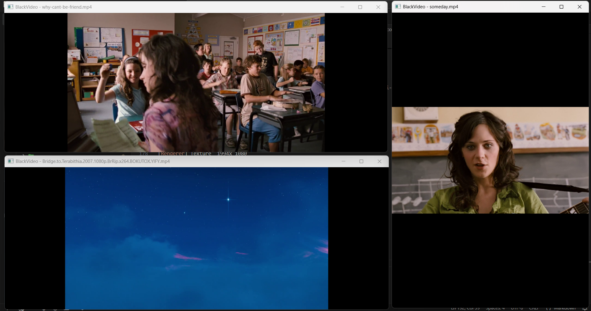
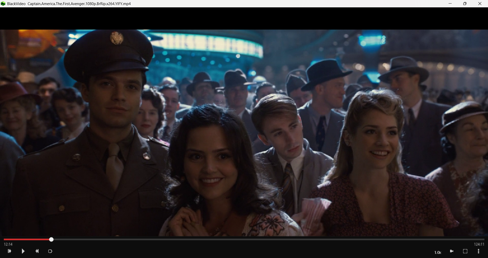
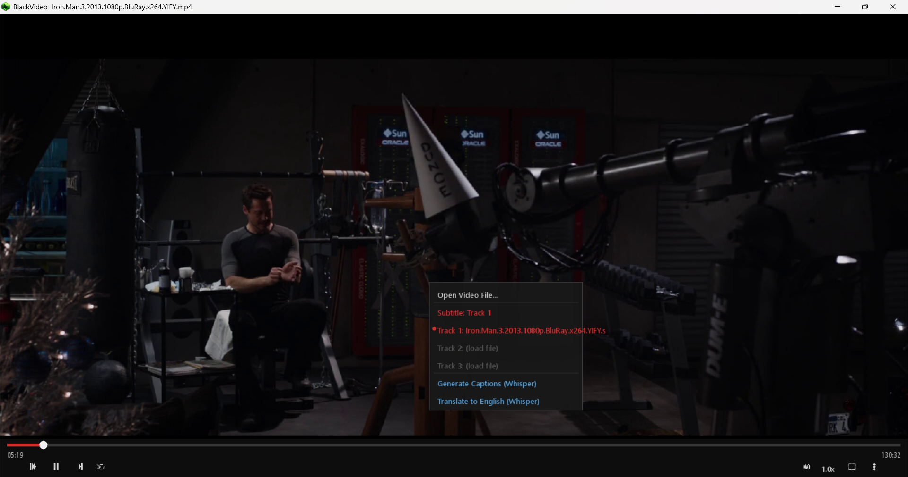
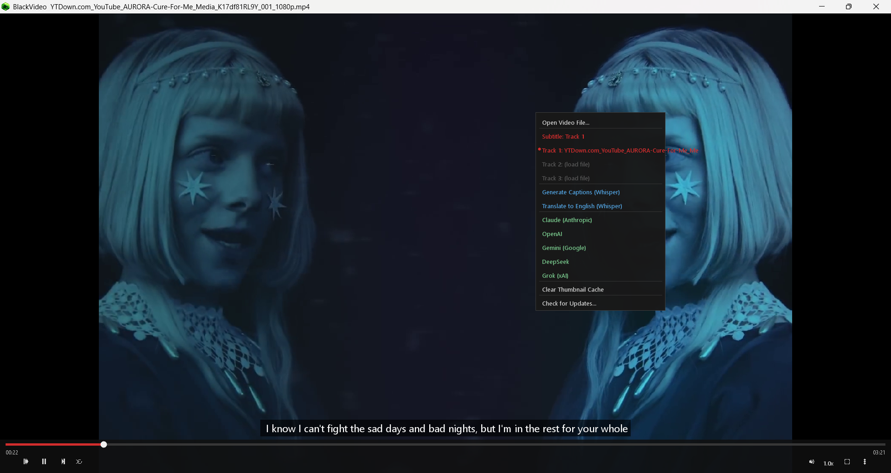

> # 2.4.0
 
New update **2.4.0** is here. This release adds **cloud LLM caption generation** (Claude, OpenAI, Gemini, DeepSeek, Grok), **sprite thumbnail hover preview** on the seek bar, a **welcome/standalone mode** with drag-and-drop, and a **GitHub auto-updater** that checks for new releases in the background.

- **Download** it [here](https://sourceforge.net/projects/blackvideo-mini-player/files/latest/download) on SourceForge or in the [release](https://github.com/BlackBlazent/blackvideo-mini-player/releases/tag/v2.4.0) page.
- [**Change logs**](https://github.com/BlackBlazent/blackvideo-mini-player/compare/v2.3.0...v2.4.0)
- Looking for [**open-source contributors for**]() `Mac` & `Linux`.

## Sample Files Generated by Whisper

The SRT files below were generated using the offline caption feature (ggml-base model).

| Video | Language | SRT |
|-------|----------|-----|
| Elon Musk's Work Ethics Will Give You Goosebumps | English | [Download](./samples/Elon%20Musk's%20Work%20Ethics%20Will%20Give%20You%20Goosebumps.mp4.srt) |
| AURORA - Cure For Me (1080p) | English | [Download](./samples/AURORA-Cure-For-Me_Media_K17df81RL9Y_001_1080p.mp4.srt) |
| BTS - Boy With Luv (feat. Halsey) | Korean | Not generated — ggml-base does not support Korean. Use ggml-large-v3. |



# BlackVideo Mini Player

Lightweight cross-platform video player (Ada + SDL2 + FFmpeg). Support player for the [BlackVideo](https://github.com/BlackBlazent/BlackVideo). Works standalone via **CLI**, **drag-and-drop**, or **right-click** on any video file.

<p align="center">
  
  
  
</p>
<p align="center">
  
  
  
  
  
  
  
  
</p>
<p align="center">
  
</p>

<p align="center">
  <!-- Big Total Downloads -->
  
  <p align="center">
  <!-- Small Latest Release Downloads -->
  
  </p>
</p>

---



<br/>



<br/>



## What's New in v2.4.0

| Feature | Description |
|---------|-------------|
| **Welcome / Standalone mode** | Launch with no argument — shows a welcome screen with Open File button and full drag-and-drop support |
| **Cloud LLM captions** | Right-click → choose Claude, OpenAI, Gemini, DeepSeek, or Grok to generate a timed SRT using a cloud AI |
| **API key overlay** | Secure masked text-input dialog to enter and save API keys per provider (stored in `%APPDATA%\BlackVideo\keys.cfg`) |
| **Sprite thumbnail preview** | Hover over the seek bar to see a JPEG frame thumbnail popup — extracted by ffmpeg in the background |
| **Auto-updater** | Background thread checks `latest.json` on GitHub at startup; shows an update badge and download overlay when a newer version is available |
| **Whisper progress %** | Live progress bar during caption generation via stderr pipe |
| **Hot-load video** | Drop or open a new video while already playing — no restart required |

---

## File Structure

```
blackvideo-mini-player/
│
├── src/
│   ├── main.adb                  ← Entry point + .env loader
│   ├── player.ads / .adb         ← Core orchestrator + event loop
│   ├── video_decoder.ads / .adb  ← FFmpeg decode pipeline
│   ├── renderer.ads / .adb       ← SDL2 texture rendering (letterbox)
│   ├── audio.ads / .adb          ← SDL2 audio callback + volume/mute/flush
│   ├── ui_overlay.ads / .adb     ← Ada wrapper for the C UI overlay
│   ├── srt_parser.ads / .adb     ← SRT subtitle file parser
│   ├── whisper_bridge.ads / .adb ← Whisper.cpp offline caption bridge
│   ├── llm_bridge.ads / .adb     ← Cloud LLM caption bridge (5 providers)
│   ├── thumb_cache.ads / .adb    ← Seek-bar sprite thumbnail cache
│   ├── updater.ads / .adb        ← GitHub release auto-updater
│   └── utils.ads / .adb          ← Base_Name, Format_Time
│
├── csrc/                         ← C sources compiled separately (not scanned by gprbuild)
│   ├── ui_overlay.c              ← SDL2-drawn control bar, context menu, overlays,
│   │                                thumbnail popup, API key input dialog
│   ├── process_helpers.c         ← CreateProcess async launcher + stderr pipe
│   ├── thumb_preview.c           ← JPEG thumbnail loader (Windows WIC) + SDL popup
│   └── llm_client.c              ← WinINet HTTPS GET/POST for LLM + updater
│
├── bindings/
│   ├── ffmpeg/
│   │   ├── ffmpeg-avutil.ads
│   │   ├── ffmpeg-avcodec.ads
│   │   ├── ffmpeg-avformat.ads
│   │   ├── ffmpeg-swscale.ads
│   │   └── ffmpeg-swresample.ads
│   └── sdl2/
│       ├── sdl.ads
│       ├── sdl-video.ads
│       ├── sdl-video-windows.ads/adb
│       ├── sdl-video-renderers.ads/adb
│       ├── sdl-video-textures.ads/adb
│       ├── sdl-events.ads/adb           ← flat byte extractor + SDL_TEXTINPUT support
│       ├── sdl-events-keyboards.ads
│       └── sdl-audio.ads
│
├── tools/
│   └── context_menu/
│       ├── install_context_menu.bat
│       ├── install_context_menu.reg
│       ├── uninstall_context_menu.bat
│       ├── uninstall_context_menu.reg
│       ├── install_linux.sh
│       ├── blackvideo-player.desktop
│       └── install_macos.sh
│
├── include/
│   └── stb_image.h         ← Placeholder (thumbnail decoding uses Windows WIC)
│
├── lib/
│   ├── include/      ← FFmpeg + SDL2 headers
│   └── *.a           ← Import libraries
│
├── build/            ← Compiled output + runtime DLLs
│   └── cache/        ← Sprite thumbnail JPEG cache (auto-created)
│
├── scripts/
│   ├── build.bat
│   └── build.sh
│
├── latest.json             ← Auto-updater manifest (place in repo root)
├── .env.example
├── WHISPER_SETUP.md
└── blackvideo_player.gpr
```

---

## Keyboard Controls

| Key | Action |
|-----|--------|
| `SPACE` | Play / Pause |
| `←` | Seek −5 seconds |
| `→` | Seek +5 seconds |
| `↑` | Volume +10 |
| `↓` | Volume −10 |
| `M` | Mute / Unmute |
| `L` | Loop toggle |
| `F` | Fullscreen toggle |
| `ESC` / `Q` | Quit |

## Playback Controls (UI Bar)

| Control | Action |
|---------|--------|
| Seek bar | Click or drag to seek |
| Seek bar hover | Shows sprite thumbnail preview at that position |
| ⏮ Prev | Seek to start |
| ⏯ Play/Pause | Toggle playback |
| ⏭ Next | Jump to near end |
| 🔁 Loop | Toggle loop |
| 🔊 Volume | Mute/unmute |
| `1.0x` Speed | Cycle 0.5× / 1.0× / 1.5× / 2.0× |
| ⛶ Fullscreen | Toggle fullscreen |
| ⋮ Menu | Open context menu |

> Right-click anywhere on the video to open the context menu.

---

## Context Menu

| Item | Action |
|------|--------|
| **Open File** | Open a video via dialog (works from welcome screen too) |
| **Subtitle: Off / Track N** | Toggle subtitles off |
| **Track 1 / 2 / 3** | Load an `.srt` subtitle file into that slot |
| **Generate Captions (Whisper)** | Offline caption generation via whisper.cpp |
| **Translate to English (Whisper)** | Offline translation + caption via whisper.cpp |
| **Captions: Claude** | Cloud LLM caption via Anthropic Claude |
| **Captions: OpenAI** | Cloud LLM caption via OpenAI GPT |
| **Captions: Gemini** | Cloud LLM caption via Google Gemini |
| **Captions: DeepSeek** | Cloud LLM caption via DeepSeek |
| **Captions: Grok** | Cloud LLM caption via xAI Grok |
| **Clear Thumbnail Cache** | Delete cached seek-bar thumbnails for this video |
| **Check for Updates** | Manually trigger the GitHub version check |

---

## Subtitles

### Loading a subtitle file manually

Right-click → **Track 1 / 2 / 3** → pick an `.srt` file. The track label updates to the filename and the active track is marked.

### Generating captions with Whisper (offline)

Right-click → **Generate Captions (Whisper)**

Uses [whisper.cpp](https://github.com/ggerganov/whisper.cpp) entirely offline — no internet, no API key. FFmpeg extracts a 16 kHz mono WAV, `whisper-cli.exe` runs in the background, and the resulting `.srt` auto-loads into Track 1. A **live progress bar** shows percentage completion.

### Translating subtitles to English

Right-click → **Translate to English (Whisper)**

Whisper's `--translate` flag transcribes and outputs English regardless of spoken language.

> **Translation target:** Currently English only. Multi-language targets are planned for a future release.

### Generating captions with a cloud LLM

Right-click → **Captions: Claude / OpenAI / Gemini / DeepSeek / Grok**

Two-step flow:
1. Whisper-tiny generates a raw transcript (~30s for a 60s clip)
2. The transcript is sent to the chosen LLM with a timing prompt
3. The LLM returns a properly timed SRT, saved beside the video and auto-loaded into Track 2

**First use:** An API key dialog appears. Type or paste your key — it is masked on screen and saved to `%APPDATA%\BlackVideo\keys.cfg`. Press **Enter** or click **OK** to save. Click **Cancel**, the **X** button, or press **Esc** to dismiss without saving.

| Provider | Key source |
|----------|------------|
| Claude | [console.anthropic.com](https://console.anthropic.com) |
| OpenAI | [platform.openai.com](https://platform.openai.com) |
| Gemini | [aistudio.google.com](https://aistudio.google.com) |
| DeepSeek | [platform.deepseek.com](https://platform.deepseek.com) |
| Grok | [console.x.ai](https://console.x.ai) |

### Whisper setup (quick reference)

Place these files in `build\` beside `blackvideo-player.exe`:

```
build\
├── blackvideo-player.exe
├── whisper-cli.exe
├── whisper.dll
├── ggml.dll
├── ggml-base.dll
├── ggml-cpu.dll
└── models\
    └── ggml-base.bin
```

`ffmpeg.exe` must be on your `PATH` or placed in `build\` for audio extraction and thumbnail generation.

See **[WHISPER_SETUP.md](./WHISPER_SETUP.md)** for the full guide.

---

## Sprite Thumbnail Preview

Hovering over the seek bar shows a 160×90 px JPEG popup at that position. Thumbnails are extracted in the background by ffmpeg (one frame per 10 seconds) and cached in `build\cache\<video-hash>\`. Right-click → **Clear Thumbnail Cache** to wipe the cache for the current video.

---

## Auto-Updater

A background thread fetches `latest.json` from the repo root at startup. If a newer version is found, an update badge appears on the menu button. Right-click → **Check for Updates** to see the version notes and open the download page. Uses WinINet — no extra DLL needed.

```json
{
  "version":      "2.4.0",
  "release_url":  "https://github.com/BlackBlazent/blackvideo-mini-player/releases/tag/v2.4.0",
  "download_url": "https://sourceforge.net/.../download",
  "notes":        "Standalone mode, sprite preview, LLM captions, auto-updater"
}
```

---

## Building

### Windows

#### Prerequisites
1. Install [Alire](https://alire.ada.dev/) (GNAT + gprbuild): `alr toolchain --select`
2. [SDL2 dev libs](https://github.com/libsdl-org/SDL/releases) (MinGW)
3. [SDL2_ttf dev libs](https://github.com/libsdl-org/SDL_ttf/releases)
4. [FFmpeg shared builds](https://github.com/BtbN/FFmpeg-Builds/releases) (win64-lgpl)
5. Copy headers + `.a` libs into `lib/`

> [**Download**](https://www.mediafire.com/file/nirdk9z1czua23s/prerequisites-setup.zip/file) the pre-assembled `lib/` and `build/` setup for Windows ✨

```bat
cd blackvideo-mini-player
scripts\build.bat
```

```bat
build\blackvideo-player.exe
build\blackvideo-player.exe "C:\Videos\movie.mp4"
```

### Linux

```bash
sudo apt install gnat gprbuild \
    libsdl2-dev libsdl2-ttf-dev \
    libavcodec-dev libavformat-dev libavutil-dev \
    libswscale-dev libswresample-dev

chmod +x scripts/build.sh && ./scripts/build.sh
./build/blackvideo-player /path/to/video.mp4
```

### macOS

```bash
brew install gnat gprbuild sdl2 sdl2_ttf ffmpeg
chmod +x scripts/build.sh && ./scripts/build.sh
./build/blackvideo-player /path/to/video.mp4
```

---

## Right-Click Integration

### Windows (Run as Administrator)
```bat
tools\context_menu\install_context_menu.bat
```
Adds "Open with BlackVideo Player" for: `.mp4 .mkv .avi .mov .wmv .webm .flv .m4v .mpg .mpeg .ts`

To remove: `tools\context_menu\uninstall_context_menu.bat`

### Linux
```bash
chmod +x tools/context_menu/install_linux.sh
./tools/context_menu/install_linux.sh
```

### macOS
```bash
chmod +x tools/context_menu/install_macos.sh
./tools/context_menu/install_macos.sh
```

---

## Tauri v2 Integration

```toml
"bundle": {
  "externalBin": ["binaries/blackvideo-player"],
  "resources": ["binaries/SDL2.dll", "binaries/SDL2_ttf.dll",
    "binaries/avcodec-62.dll", "binaries/avformat-62.dll",
    "binaries/avutil-60.dll", "binaries/swscale-9.dll",
    "binaries/swresample-6.dll"]
}
```

```rust
#[tauri::command]
fn open_video(path: String) {
    Command::new_sidecar("blackvideo-player")
        .expect("sidecar not found")
        .args([path])
        .spawn()
        .expect("failed to launch player");
}
```

---

## Required Files

### DLLs — place in `build\`

| DLL | Source |
|-----|--------|
| `SDL2.dll` | SDL2 MinGW release |
| `SDL2_ttf.dll` | SDL2_ttf-devel-2.0.12-VC |
| `libfreetype-6.dll` | Bundled with SDL2_ttf-devel-2.0.12-VC |
| `zlib1.dll` | Bundled with SDL2_ttf-devel-2.0.12-VC |
| `avcodec-62.dll` | FFmpeg shared build |
| `avdevice-62.dll` | FFmpeg shared build |
| `avfilter-11.dll` | FFmpeg shared build |
| `avformat-62.dll` | FFmpeg shared build |
| `avutil-60.dll` | FFmpeg shared build |
| `swresample-6.dll` | FFmpeg shared build |
| `swscale-9.dll` | FFmpeg shared build |

**Optional Whisper DLLs:**

| DLL | Source |
|-----|--------|
| `whisper.dll` `ggml.dll` `ggml-base.dll` `ggml-cpu.dll` | whisper-bin-x64.zip |

### Headers — `lib/include/`

`libavcodec/` `libavdevice/` `libavfilter/` `libavformat/` `libavutil/` `libswresample/` `libswscale/` `SDL2/`

### Import Libraries — `lib/`

`libavcodec.a` `libavdevice.a` `libavfilter.a` `libavformat.a` `libavutil.a` `libSDL2.a` `libSDL2main.a` `libSDL2_ttf.dll.a` `libswresample.a` `libswscale.a`

---

## Design Notes

**Flat byte extraction for SDL events:** Ada's discriminated unions cannot safely map to C anonymous unions without `Unchecked_Union`. The flat `Raw_Bytes` + offset extractors in `SDL.Events` are simpler and portable. `SDL_TEXTINPUT` events are handled the same way, enabling the API key input dialog.

**`csrc/` vs `src/`:** GPRbuild compiles every file in `src/` as Ada. C files live in `csrc/` to stay invisible to GPRbuild; `build.bat` compiles them with `gcc` and passes the `.o` files directly to the linker.

**Thumbnail decoding — Windows WIC:** `thumb_preview.c` uses `wincodec.dll` (built into Windows 7+) to decode JPEGs. No `stb_image.h` download needed. Falls back to SDL_image on Linux/macOS.

**LLM two-step flow:** Whisper-tiny generates a raw transcript, which is sent to the cloud LLM with a timing prompt. The LLM returns a formatted SRT. Providers with native audio support (OpenAI, Gemini) can skip the transcript step.

**Audio re-init on hot-load:** `Audio.Stop` closes the SDL audio device. `Open_Video` calls `Audio.Init` to re-open it before starting playback on the new video, ensuring audio always works after drag-and-drop or file dialog.

**Auto-updater thread safety:** The version check runs on a `CreateThread` background thread (`Convention => Stdcall`). The result flag is written once and polled each frame by the main loop — no mutex needed.

**Letterbox rendering:** `Renderer.Fit_Rect` computes `scale = min(win_w/vid_w, win_h/vid_h)` and centres the video with black bars at any window size.

---

## Contributing

1. Fork the repository and create a new branch
2. Make your changes and commit
3. Push and open a pull request

Please read [CONTRIBUTING.md](CONTRIBUTING.md) for guidelines.

## License

MIT License — see [LICENSE](LICENSE) for details.